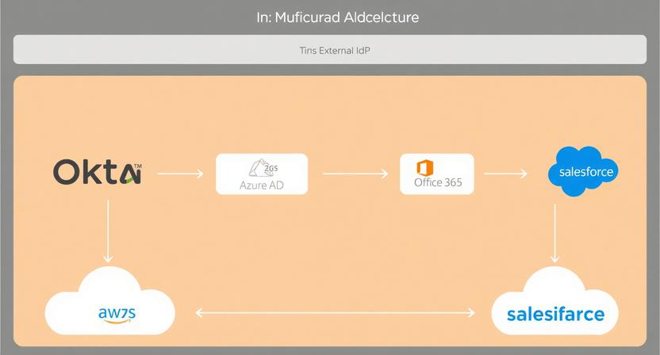

<!DOCTYPE html>
<html lang="en">
<head>
  <meta charset="UTF-8" />
  <meta name="viewport" content="width=device-width, initial-scale=1.0"/>
  <link rel="stylesheet" href="styles.css" />
</head>
<body>
  

  

</body>
</html>

# Summary

This portfolio showcases my understanding of Cloud Security & IAM, protecting cloud environments, and managing user access effectively. Cloud Security involves implementing measures such as encryption, firewalls, and monitoring to safeguard data and resources in the cloud. Identity and Access Management (IAM) ensures that the right individuals have secure access to the appropriate resources, using tools like multi-factor authentication, role-based access control, and user policies. Together, they form the foundation for secure, compliant, and efficient cloud operations.

---

# Cloud Security & IAM Overview

Cloud Security encompasses the strategies, policies, and technologies used to protect cloud-based systems, data, and infrastructure from cyber threats. It involves measures such as encryption, intrusion detection systems, security groups, and continuous monitoring to ensure the confidentiality, integrity, and availability of cloud resources.

Identity and Access Management (IAM) is a critical component of cloud security that manages user identities and controls access to cloud resources. It involves creating and managing user accounts, setting permissions, and implementing authentication mechanisms like multi-factor authentication (MFA) to ensure that only authorized individuals can access specific data and services.

Key Components:

Encryption: Protects data at rest and in transit.
Access Controls: Define who can access what and under which conditions.
Monitoring & Auditing: Track activities for suspicious behavior and compliance.
Multi-Factor Authentication (MFA): Adds an extra layer of security for user verification.
Role-Based Access Control (RBAC): Assigns permissions based on user roles.
Importance:
Cloud Security & IAM are vital for safeguarding sensitive information, maintaining regulatory compliance, and ensuring operational resilience in cloud environments.:

---

Cloud Security Domains

---
## Domain 1: Cloud Concepts, Architecture, and Design! [Badge](https://img.shields.io/badge/Cloud%20Concepts-Architecture-brightblue?style=for-the-badge&logo=cloud)

Understanding the fundamental principles of cloud computing, including deployment models (public, private, hybrid) and architectural frameworks. Focus on designing scalable, resilient, and secure cloud solutions.

---

## Domain 2: Cloud Data Security 

Exploring methods to protect data throughout its lifecycle, such as encryption, data masking, and privacy techniques. Emphasis on securing data at rest, in transit, and during processing.

---

## Domain 3: Cloud Platform and Infrastructure Security 

Securing virtualized environments, cloud networks, and platform components. Applying design patterns and control strategies to safeguard infrastructure from threats and vulnerabilities.

---

## Domain 4: Cloud Application Security 

Implementing secure development practices, conducting application testing, and ensuring software assurance in cloud applications. Focus on minimizing vulnerabilities and ensuring secure deployment.

---

## Domain 5: Cloud Security Operations 

Mastering tools and processes for continuous monitoring, incident detection, response, and operational resilience. Emphasizes maintaining security posture in dynamic cloud environments.

---

## Domain 6: Legal, Risk, and Compliance

Understanding relevant laws, regulations, and frameworks governing cloud security. Learning risk management techniques to ensure compliance and mitigate legal and operational risks.

---

### **Identity and Access Management (IAM)**

**Identity and Access Management (IAM)** is a fundamental aspect of cloud security that involves managing digital identities and controlling access to cloud resources. It ensures that only authorized users and systems can perform specific actions, thereby safeguarding sensitive data and infrastructure.

**Core Features of IAM:**
- **User Identity Management:** Creating, updating, and deleting user accounts.
- **Authentication:** Verifying user identities through methods such as passwords, MFA, and federated identity providers.
- **Authorization:** Assigning permissions and roles to define what resources users can access and what actions they can perform.
- **Role-Based Access Control (RBAC):** Simplifies permission management by assigning predefined roles to users based on their responsibilities.
- **Policy Management:** Defining security policies that govern access rules and conditions.

**Best Practices:**
- Implement multi-factor authentication (MFA) for all users.
- Follow the principle of least privilege—grant only necessary permissions.
- Regularly review and audit access logs and permissions.
- Use roles and groups to streamline permission management.

**Benefits:**
- Enhanced security by controlling access tightly
- Simplified user management
- Improved compliance with regulatory standards
- Reduced risk of insider threats and data breaches

---

# 🛡️ Establishing IAM

---

## 1. **Creating Users in the Admin Console**

-  Assigning Super Admin Role to a User

-  Configure Group Membership Rules

---

## 2. **Define User Roles and Groups**
- Categorize users based on responsibilities (e.g., **Admin**, **Developer**, **Auditor**).
- Create groups corresponding to these roles for easier management.

---

## 3. **Determine Access Requirements**
- Identify the permissions each group needs.
- **Apply the principle of least privilege** — users should only have permissions necessary for their tasks.

---

## 4. **Create IAM Policies**
- Write policies that specify **allowed actions**, **resources**, and **conditions**.
- Use predefined templates or customize policies as needed.

---

## 5. **Assign Users to Roles and Policies**
- Add users to groups or assign individual policies.
- **Regularly review and update** these assignments for relevance.

---

## 6. **Implement Multi-Factor Authentication (MFA)**
- Enforce MFA for all users to add an extra layer of security.

---

## 7. **Monitor and Audit Access**
- Enable logging of access and actions.
- **Regularly review logs and permissions** for anomalies or unnecessary privileges.

---

## 8. **Review and Update Regularly**
- Conduct periodic reviews of roles, permissions, and policies.
- **Adjust policies** as organizational needs evolve.

---

---

## 5. **Assign Users to Roles and Policies**
- Add users to groups or assign individual policies.
- **Regularly review and update** these assignments.

---

## 6. **Implement Multi-Factor Authentication (MFA)**
- Enforce MFA for all users to add an extra layer of security.

---

## 7. **Monitor and Audit Access**
- Enable logging of access and actions.
- **Regularly review logs and permissions** for anomalies or unnecessary privileges.

---

## 8. **Review and Update Regularly**
- Conduct periodic reviews of roles, permissions, and policies.
- **Adjust policies** as organizational needs evolve.

---

# 🔐 IAM Tools

Here are some popular **Identity and Access Management (IAM)** tools that can help you streamline user management, permissions, and security:

---

## ☁️ Cloud Provider Native IAM Tools
- **AWS IAM**: Comprehensive IAM solution for managing access to Amazon Web Services resources.
- **Azure Active Directory (Azure AD)**: Microsoft's identity management platform supporting single sign-on and multi-factor authentication.
- **Google Cloud IAM**: Google's IAM service for managing access and permissions across Google Cloud resources.

---

## 🛠️ Third-Party IAM Solutions
- **Okta**: Unified identity management and Single Sign-On (SSO), supporting multi-cloud environments and enterprise integrations.
- **Ping Identity**: Advanced authentication and access management supporting multi-factor authentication and zero-trust security.
- **Auth0**: Developer-friendly identity platform with support for various authentication methods and custom rules.
- **Salesforce**: Built-in identity and access management features within the Salesforce ecosystem, enabling secure user access and federation.

---

## 🧩 Open Source IAM Tools
- **FreeIPA**: Linux-based centralized identity management system for authentication and policy enforcement.

---

**Choosing the right IAM tools** depends on your cloud environment, organizational size, and security needs. Combining these solutions can help you build a more secure, flexible, and scalable identity management system.

---

# 🚀 Projects & Labs: Advanced IAM Integration Strategies

---

## 🔗 Deep Dive into Multi-IAM Integration

In complex enterprise environments, integrating multiple IAM systems enhances security, streamlines management, and provides seamless access across diverse platforms. Below are key integration patterns, technical details, and diagrams to illustrate these concepts.

---

## 1. **Integrating Okta with Office 365**

### **Technical Overview:**
- **Purpose:** Centralize identity management for Office 365 users via Okta.
- **Protocols Used:** **SAML 2.0**, **OAuth 2.0**, **SCIM**.
- **Components:**
  - **Okta (IdP):** Serves as the primary identity provider.
  - **Office 365 / Azure AD (SP):** Accepts SAML/OAuth assertions.
  - **SCIM:** Automates user provisioning/deprovisioning.

## 2. Connecting Salesforce with AWS

### **Technical Overview**

- **Purpose:**  
  Enable Salesforce users to securely access AWS resources through federation.

- **Protocols:**  
  **SAML 2.0** for federation and single sign-on.

- **Components:**  
  - **Salesforce (IdP):** Acts as the Identity Provider, authenticating users.
  - **AWS IAM Identity Provider:** Configured to trust Salesforce as a SAML IdP.
  - **IAM Roles:** Users assume specific roles in AWS based on SAML assertions.

---

graph TD
    subgraph External IdPs
        Okta[Okta]
        Azure[Azure AD]
        Salesforce[Salesforce]
    end

    subgraph Cloud Resources
        AWS[AWS]
        Office365[Office 365]
        SalesforceRes[Salesforce]
    end

    Okta -->|Trust| AWS
    Azure -->|Trust| AWS
    Salesforce -->|Trust| AWS
    Okta -->|Trust| Office365
    Azure -->|Trust| Office365
    Salesforce -->|Trust| SalesforceRes
    
---

sequenceDiagram
    participant User
    participant Salesforce
    participant AWSIdP
    participant AWS

    User->>Salesforce: Login & MFA
    Salesforce->>User: SAML Assertion
    User->>AWSIdP: Send SAML Assertion
    AWSIdP->>AWS: Verify & Trust
    AWS->>User: Temporary Credentials

    ---

    graph TD
    IdP[External IdP (Okta/Azure AD)]
    Cloud[Cloud Service (AWS)]
    Resources[Resources (S3, EC2, etc.)]

    IdP -- Trust Policy --> Cloud
    Cloud -- Role Assumption --> Resources

    ---

## 3. Federating AWS with External IAMs (Okta, Azure AD)

### **Technical Overview**

- **Purpose:**  
  Enable centralized user identity management across multiple cloud platforms, simplifying access and improving security.

- **Protocols:**  
  Support for **SAML**, **OAuth 2.0**, and **OpenID Connect** ensures interoperability and flexibility.

- **Components:**  
  - **External IdP (Okta / Azure AD):** Manages user credentials, authentication, and federation services.
  - **AWS IAM Trust Policies:** Configured to allow external IdPs to assume roles and access AWS resources.
  - **User:** Authenticates via the external IdP to gain access to AWS resources.

---

sequenceDiagram
    participant User
    participant ExternalIdP
    participant AWS

    User->>ExternalIdP: Login & MFA
    ExternalIdP->>User: SAML/OAuth/OpenID Token
    User->>AWS: Present Token via Federation
    AWS->>AWS: Verify Token & Trust Policy
    AWS->>User: Access to Resources

    <!DOCTYPE html>
<html lang="en">
<head>
  <meta charset="UTF-8" />
  <meta name="viewport" content="width=device-width, initial-scale=1.0"/>
  <link rel="stylesheet" href="styles.css" />
</head>
<body>
  

  

</body>
</html>
---

## 🚀 4. Best Practices & Technical Considerations

---

### ✅ 1. Use Standards-Based Protocols
- **Adopt protocols like** **SAML**, **OAuth 2.0**, and **OpenID Connect** to ensure interoperability across diverse IAM systems and cloud platforms.

---

### 🔑 2. Maintain a Single Source of Truth
- Centralize user identities within a trusted identity provider to prevent discrepancies and simplify management.

---

### ⚙️ 3. Automate User Provisioning & Deprovisioning
- Utilize **SCIM (System for Cross-domain Identity Management)** or **API integrations** to automate account creation, updates, and revocations based on organizational changes.

---

### 🔐 4. Enforce MFA & Least Privilege
- Mandate **Multi-Factor Authentication (MFA)** for all users to enhance security.
- Follow the **least privilege principle**—grant only permissions necessary for each user's role to minimize risk.

---

### 🔍 5. Regularly Review Policies & Logs
- Conduct periodic audits of **trust policies**, **access logs**, and **permissions**.
- Adjust policies as organizational needs evolve to maintain security and compliance.

---

### 📝 Summary
Implementing these best practices ensures a robust, secure, and manageable IAM environment across your cloud and on-premises infrastructure.

---

## 🌐 Multi-IAM Federation Architecture

graph TD
    %% External Identity Providers (IdPs)
    subgraph External IdPs
        Okta[Okta]
        Azure[Azure AD]
        Salesforce[Salesforce]
    end

    %% Cloud Resources (Target Services)
    subgraph Cloud Resources
        AWS[AWS]
        Office365[Office 365]
        SalesforceRes[Salesforce]
    end

    %% Trust relationships
    Okta -->|Trust| AWS
    Azure -->|Trust| AWS
    Salesforce -->|Trust| AWS
    Okta -->|Trust| Office365
    Azure -->|Trust| Office365
    Salesforce -->|Trust| SalesforceRes

  Still in progress.....
